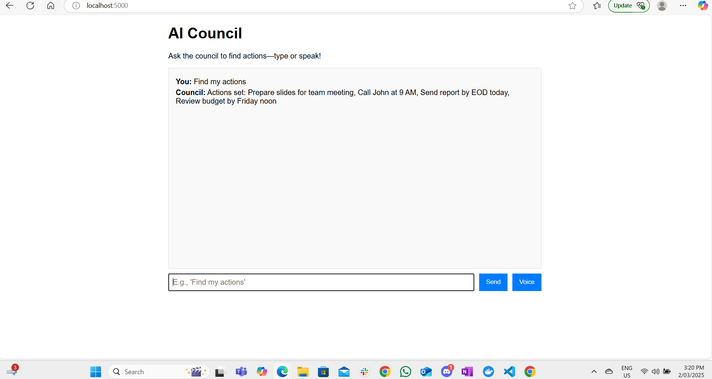

# AI Council

A friendly little team of AIs that reads messages and figures out what to do next—all with a voice you can talk to!

  
*Say “Find my actions” and hear the council’s suggestions—like “Prep slides for 3 PM!”*

## What It Does
- Looks at mock Outlook and Teams messages (e.g., “Meeting at 3 PM tomorrow”).
- Three AIs work together:
  - **Extractor**: Spots actions like “Prep slides.”
  - **Validator**: Checks if they make sense.
  - **Decider**: Picks the final to-dos.
- Replies with a short list—type or talk to it!

## Tech Stuff
- **AI**: DeepSeek-R1 (7B) via Ollama
- **App**: Flask (Python)
- **Voice**: Web Speech API in the browser
- **Runs In**: Docker

## Try It Out
1. **Grab It**:
   ```bash
   git clone https://github.com/dbodduluru/ai-council.git
   cd ai-council